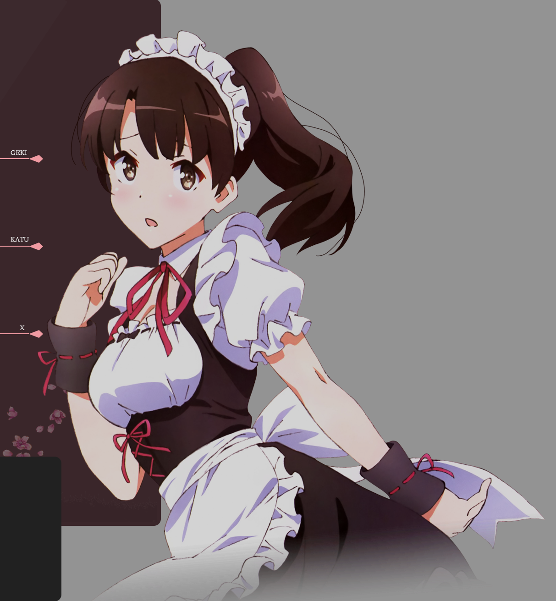

<h2> Nơi lưu các bài tập xử lí ảnh số </h2>

<h3> Tuần 2 </h3>

- Nhận diện khuôn mặt, chụp ảnh bằng camera
- Sử dụng hình ảnh đã chụp để train, sau đó nhận diện ai chính xác ai trong camera (cần 3 tập thư mục hình ảnh khác nhau)
- Nhận diện các vật thể có trong hình ảnh (con người, voi, xe buýt ...)

<h3> Tuần 3 </h3>

- Dùng yolo v8 train trên gg colab để nhận diện road sign
- Tải file best.pt về và dùng để nhận diện các biển báo giao thông trong hình ảnh